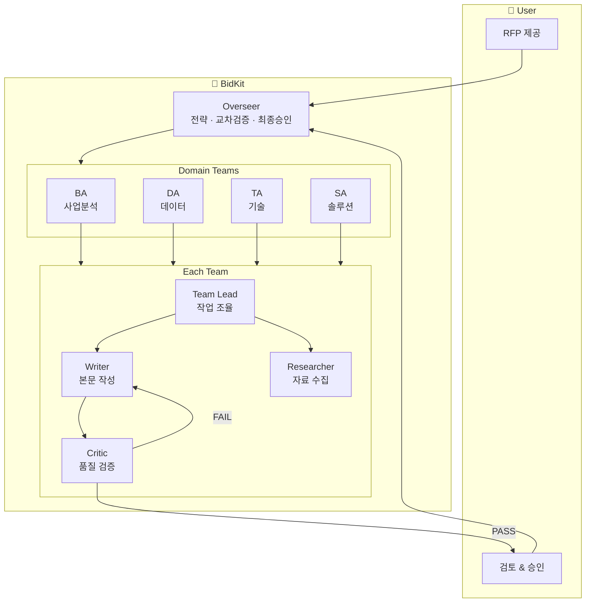
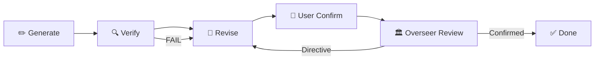
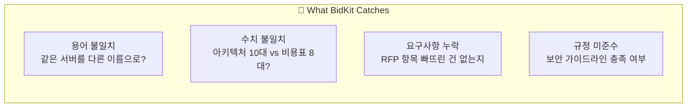
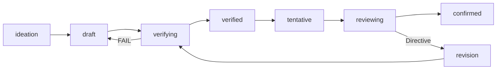

# BidKit

**제안서, 이제 AI 에이전트 팀이 같이 씁니다.**

탑티어 수준의 기술 제안서를 전략 수립부터 최종 출력까지, 5개 전문 에이전트가 분업하여 작성하는 Claude Code 플러그인입니다.

---

## Why BidKit

제안서를 써본 사람이라면 공감할 겁니다:

- 스펙 하나 바뀌면 비용표도, 이행계획도 줄줄이 수정
- "이 숫자 저쪽 섹션이랑 맞아?" 교차 확인에 반나절
- 여러 명이 쓴 문서의 용어가 제각각
- 마감 직전에 RFP 보완공고

BidKit은 이런 문제를 **5개 전문 에이전트의 협업 구조**로 해결합니다.

---

## How It Works



### Session Loop

모든 섹션은 이 사이클을 거칩니다. 사용자가 승인하지 않으면 어떤 내용도 확정되지 않습니다.



### Cross-Verification

섹션 간 불일치를 자동으로 잡아냅니다:



---

## Quick Start

```bash
# Claude Code에서 플러그인 로드
claude --plugin-dir /path/to/bidkit
```

그다음, 말만 하면 됩니다:

```
"RFP 받았는데 제안서 만들어야 해"
```

BidKit이 알아서 전략 수립부터 시작합니다. 명령어를 외울 필요 없습니다.

---

## Usage Examples

```
"HSM 모델 변경해야 해"           →  해당 섹션 자동으로 열고 수정
"전체적으로 좀 약한 것 같아"       →  전 섹션 품질 진단 + 개선 우선순위
"교차 검증해줘"                   →  숫자 · 용어 · 수량 일관성 체크
"진행 상황 알려줘"                →  팀별 진행률 + 다음 할 일 안내
"PDF로 출력해줘"                  →  확정 섹션만 모아서 렌더링
```

명령어를 쓰고 싶다면:

| Command | Purpose |
|---------|---------|
| `/bid:design` | 전략 수립 + 목차 생성 |
| `/bid:write <section>` | 섹션 작성/수정 |
| `/bid:diagnose` | 전체 품질 진단 |
| `/bid:verify` | 교차 검증 |
| `/bid:status` | 진행 현황 |
| `/bid:setup` | 환경 점검 |

---

## Key Features

### SSOT-Based Section Management

모든 섹션은 독립된 SSOT (Single Source of Truth) 문서로 관리됩니다. 누가, 무엇을, 어디까지 했는지 항상 추적됩니다.



### Impact Analysis

확정된 섹션을 수정하면, 영향받는 다른 섹션을 자동으로 파악하고 알려줍니다.

### Document Parser (Optional)

PDF는 바로 읽고, PPTX/DOCX/XLSX는 parser 설치 후 사용:

```bash
pip install bidkit-parser
```

필요한 시점에 BidKit이 자동으로 안내합니다.

---

## Platform Support

| Platform | Entry Point | Interface |
|----------|-------------|-----------|
| **Claude Code** | `CLAUDE.md` | `/bid:` commands or natural language |
| **Codex** | `AGENTS.md` | Natural language |

---

## License

MIT
